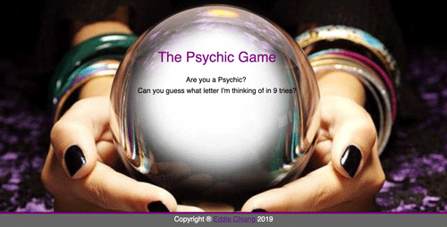

# Psychic-Game
Are you a psychic?  Can you guess the letter that I'm thinking of in 9 tries? This app runs in the browser and features dynamically updated HTML powered by JavaScript code.

## App Interface
Instructions:
* The app randomly picks a letter, and the user has to guess which letter the app chose.
* User guesses are displayed dynamically.
* Wins and losses are tracked and displayed.
* Once game is over, app will automatically pick a new letter.

Click on the link!
https://echiang73.github.io/Psychic-Game/

## Built with
* HTML5
* CSS3
* JavaScript

### Here is the preview of the web application:

